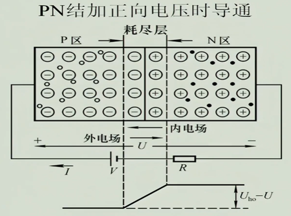
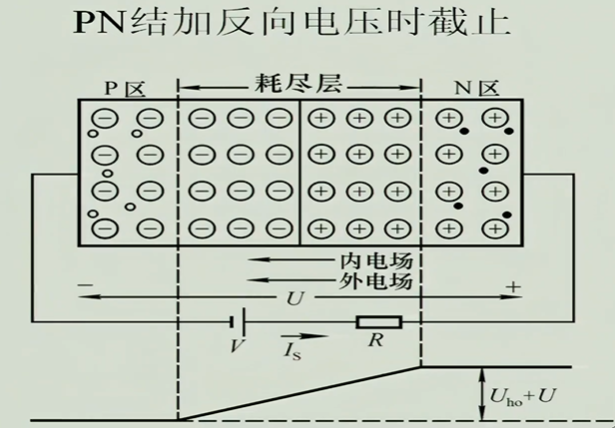
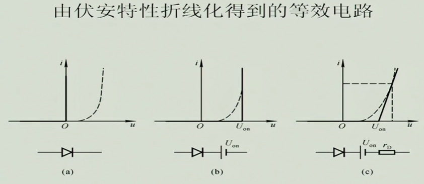

# 常用半导体器件

## 基础知识

### 本征半导体

+ 半导体概念：介于导体和绝缘体之间的材料

+ 本征半导体：四价元素，纯净的，具有晶体结构的半导体

#### 本征半导体的晶体结构

+ 本征半导体结构示意图---共价健

#### 载流子

+ 本征激发: 在热运动的作用下，价电子跳跃共价键的束服，产生自由电子，但数量很少

+ 载流子有两种---自由电子和空穴

  + 自由电子带负电

  + 空穴带正电

+ 复合--自由电子撞到空穴里，叫复合

+ 本征激发和复合的速度，以及温度决定载流子的浓度

#### 载流子的浓度

+ 本征半导体的导电能力和载流子的浓度相关

+ 载流子浓度和温度相关

+ 当温度升高，载流子浓度升高

+ 当温度升到临界值后，载流子浓度将不再上升，即复合的速度和本征激发的速度近似平衡

+ 本征激发所产生的浓度相对于实际使用所需的导电能力来说，非常弱小

### 杂质半导体

+ 概念：在本征半导体中，掺入少量的杂质元素

#### N型半导体:掺入磷 P（五价元素）

+ 磷原子贡献了自由电子，所以称为施主原子

+ 形成多数自由电子，即多子，而自由电子带负电，所以叫**N型半导体 Negative**

+ 而空穴相对变少，即少子

+ 温度对N型半导体的自由电子影响不大，因为掺入磷后，自由电子基数变的非常大，所以影响可以忽略

+ 温度对N型半导体的空穴影响很大，很敏感，因为原来空穴就少

+ 如果半导体器件某一特性和少子相关，则温度对其影响很大，如果此特性跟多子相关，则影响很小

#### P型半导体:掺入硼 N (3价元素) Positive

+ 多数载流子是空穴，自由电子是少子

+ 因为空穴是多子，带正电，所以叫**P型半导体，Positive**

### PN结

#### PN结的形成

+ 当P型半导体与N型半导体放到一起后，因扩散运动，相近的交界面处自由电子和空穴会复合，形成空间电荷区(阻止电荷扩散)

+ 空间电荷区：耗尽层，阻档层，也叫PN结，相当于一个势垒(堤坝)，阻止两边的自由电子和空穴复合

  

+ 当两边的空穴和自由电子浓度相近，多子的扩散运动和少子的漂移运动形成动态平衡，这种结叫做对称结

+ 当两边空穴和自由电子浓度相差很大，中间形成的PN结，因空间电荷区宽窄不一样（浓度高的一边窄，浓度低的一边宽），叫不对称结

+ 因PN结的阻档，不再导电

#### PN结的单向导电性

+ **PN结加正向电压**

+ 当从P向N加正向电正,正向电压从小升大时，会逐渐冲垮PN结的堤坝(外电场削弱了内电场，使得扩展运动得以恢复，电流迅速增大)，最终导通

+ 加正向电压时，电流迅速增大，所以**需加限流电阻I=U/R**，以免烧坏PN结

+ **PN结加反向电压**

+ 当PN结加反向电压时，内电场与外电场的方向一致，会导致PN结、即耗尽层加厚，导致不再导电

#### PN结的伏安特性

+ **正向特性**

+ 死区：指当PN结加上正向电压时，电流不会立即增加的现象

+ 导通电压：基材是锗：0.2-0.3V  基材是硅：0.6-0.8V

+ **反向特性**

+ 反向饱和电流：

+ 反向击穿：当反向击穿，电流变大，温度升高到一定程度，PN结会烧毁

  + 雪崩击穿，掺杂浓度低时,PN结宽

  + 齐纳击穿，掺杂浓度高时,PN结窄

#### PN结的电容效应

+ **势垒电容**：自由电子和空穴平衡

+ **扩散电容**：非平衡少子

### 半导体二极管

#### 伏安特性

+ 因为电阻的存在，相同电压下，电流比PN结小

+ 反向电流比PN结大一些

#### 温度的影响

+ 当温度升高时，正向特性向左移，反向特性向下移

+ 室温下，每上升1度，正向压降减小2-2.5mV,每增高10度，反向电流增加1倍

#### 二级管的主要参数

+ If: 最大整流电流，二极管长期工作时，所能够通过的正向平均电流的最大值，代表二极管工作是的功率电流值

+ Ur: 最高反向工作电压，超过会被击穿

+ Ir: 反向电流，越小代表反向截至特性越好

+ fm: 最高工作频率,在这个频率下二极管可用

+ 二极管是一个非线性电阻

#### 二极管的直流等效电路

+ 伏安特性折线化

  - a.理想情况下，严格遵守单向导通特性

  - b.当输入电压大于导通电压时，二极管导通，导通后，维持导通电压近似不变

+ 当交易的电压很小，不足以使二极管导通时，可以加一个直流电，将交流电压抬高，但幅值不变，则可以出现小的整流效果

#### 稳压管的伏安特性和等效电路

+ 稳压二极管工作需满足输入电压大于Uz，并且经过电流大于Iz但小于最大电流Izm

+ 使用过程中，**限流电阻**必不可少

+ 小于6V的齐纳击穿的多

+ 大于6V的雪崩击穿的多

+ 6V的一半一半

+ 主要参数：

  + 温度系数a(阿尔法)：温度每变化一度，Uz稳定值的变化量

    + 小于4V的齐纳击穿型稳压二极管的温度系数是正的，因为温度上升更容易击穿

    + 大于7V的雪崩击穿型稳压二极管的温度系数是负数，因为温度上升更难击穿

  + 稳压值Uz（标称/范围）V:

  + 阻抗（欧姆）

  + 耗散功率Pd

  + 反向电流 Ir

### 双极晶体管 BJT

+ 空穴和自由电子都参与导电

#### 结构及类型

+ 构成方式

+ 发射极：发射载流子的区域，掺杂浓度最高

+ 集电区：收保载流子的区域，不能过高掺杂浓度，但面积一定要大

+ 基区：

+ 结构： 三个区域，三个电极，两个PN结

#### 电流放大作用