#

## 单片机最小系统
+ 是指用最少的元件组成的单片机可以工作的系统，对于51系统单片机来说，单片机+晶振电路+复位电路，便组成了一个最小系统
+ **晶振电路**是单片机的振荡电路，通过晶振来放大输出信号
+ **复位电路**则用于重置单片机的系统状态，使期重新初始化

+ 原理图四要素
  + 网络标签
    + 表示一个电气连接点，具有相同网络标签的器件，表明是电气连接在一起的
    + 简化连接，便于理解
    + 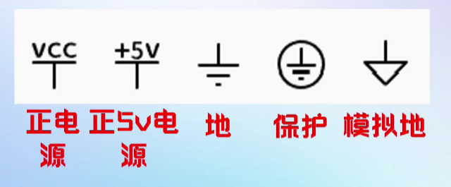
  + 连接线
    + 表示的是实际电路中的导线
    + 在原理图中虽然是一根线，但在常用的印刷电路板中往往不是线而是各种形状的铜箔条、铜箔块
  + 结点
    + 表示几个元件引脚或几条导线之间相互的连接关系
    + 所有和结点相连的元件引脚、导线，不论数目多少，都是导通的
  + 注释
    + 标注模块功能
    + 标注关键参数/信号
    + 元件功能说明  NC/NF/0R
    + 公司logo/版本号
    + 其它说明信息

+ 关联参考方向：指当电流的参考方向与电压的参考方向一致时，则把电流和电压的这种参考方向称为关联参考方向，否则为非关联参考方向

+ 电阻器（resistor）
  + 是一个限流元件，将电阻接在电路中后，电阻器的阻值是固定的
  + 一般是两个引脚，它可以限制通过它所连支路的电流大小
  + 是体现电能转化为其他形式能力的二端器件，用字母R来表示，单位为欧姆Ω
  + 阻值不能改变的称为固定电阻器
  + 阻值可变的称为**电位器**或**可变电阻器**
  + 端电压与电流有确定函数关系，
  + 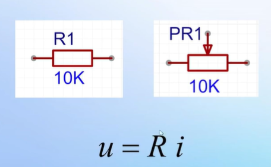
+ 电阻分类:不同类型电阻，额定功率不同
  + 插件电阻
  + 贴片电阻
  + 电位器
  + 热敏电阻（PTC
+ 贴片电阻读数
  + 3位读数：前2位为有效数字，第3位表示10的n次幂(也可以理解为0的个数)，精度为5%
  + 4位读数：前3位为有效数字，第4位表示10的n次幂，精度为1%
  + 阻值小于10的读数：通常在两个数之前插入一个字母R，用字母R来代替小数点

+ 电容元件（Capacitance）
  + 电容是一个储通元件，本身不消耗电能
  + 又叫电容器，是指容纳电荷本领的物理量
  + 电容一般用C表示，单位是法拉，简称法，符号是F
  + 常用的电容单位有毫法mF，微法uF,纳法nF和皮法pF，单位为千进位
  + 在实际电子产品应用中，根据电容“**通交流，隔直流**”的特性，在电路中所起的作用主要是**储能和滤波**
  + 
+ 电容分类
  + 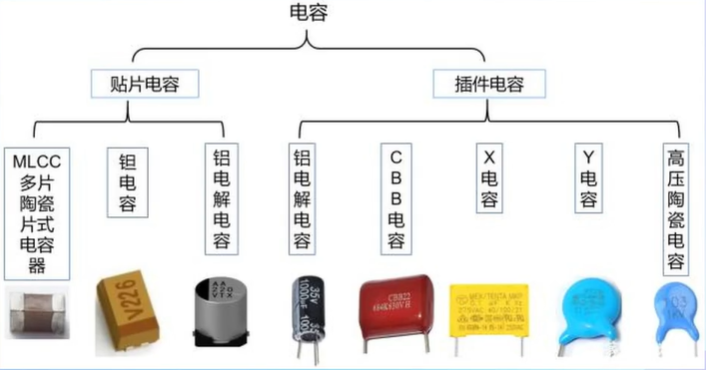
  + 不同类型的电容，其电气特性不同
  + MLCC贴片陶瓷电容
    + 在中高频段的滤波特性比较好，但容易普通较低
  + 坦电容和铝电解电容
    + 容值一般比MLCC要高，但在高频段的滤波效果，没有MLCC好
    + 一般用于中低频段的滤波
  + 实际滤波电路中，往往会将多个类型的电容器并联，以达到1+1大于2的效果
  + 电容在设计时应该注意极性，如铝电解电容和坦电容
  + 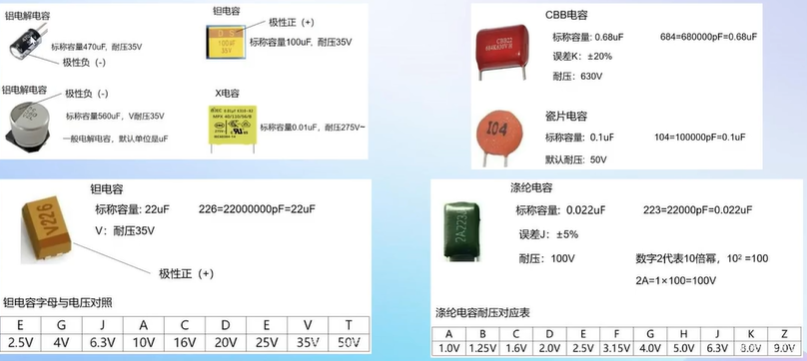

+ 电感元件(Inductor)
  + 是能够把电能转化为磁能而存储起来的元件
  + 电感通常用字母L表示，单位是亨利，简称亨，符号是H
  + 常用的电感单位有亨H,毫亨mH,微亨uH,单位是千进位
  + 实际应用中，根据电感“通直流，隔交流”的特性，主要用于**滤波，扼流，谐振和储能**
  + 本身不消耗能量，而是将能量储存起来
  + 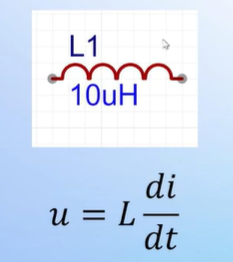
+ 电感分类
  + 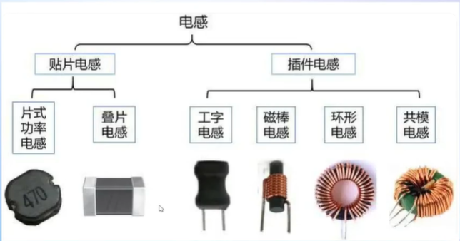
  + 共模电感有四个引脚，而其它电感通常是两个引脚
  + 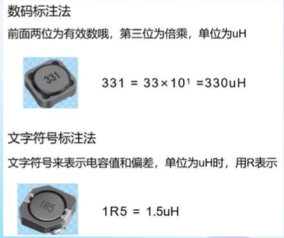
  
+ 二极管
  + 二极管是用半导体材料（硅、硒、锗等）制成的一种电子器件
  + 二极管有两个电极，正极和负极
  + 给二极管两端加正向电压时，二极管导通，加反向电压时，二极管截止
  + 二极管具有单向导电性，导通时电流方向是由正极流向负极
  + 在实际应用中，可用于对交流电整流，对调制信号检波、限幅和钳位以及对电源电压的移稳压等
  + 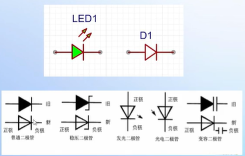
  + 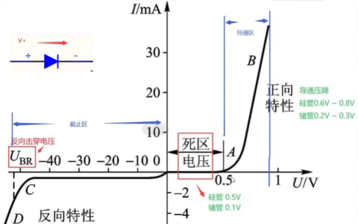
  + 二极管并不是完全没有损耗的，根据材料不同，存在不同的导通压降
    + 硅管 0.6~0.8V
    + 锗管 0.2~0.3V
    + 肖特基二极管压降很低
    + 在电源的输入端接一个二极管用来防反接，导通压降应该越小越好，所以采用肖特基二极管
  + 二极管死区电压
    + 不同材料的死区电压不同
    + 硅管：0~0.5V
    + 锗管：0~0.1V
  + 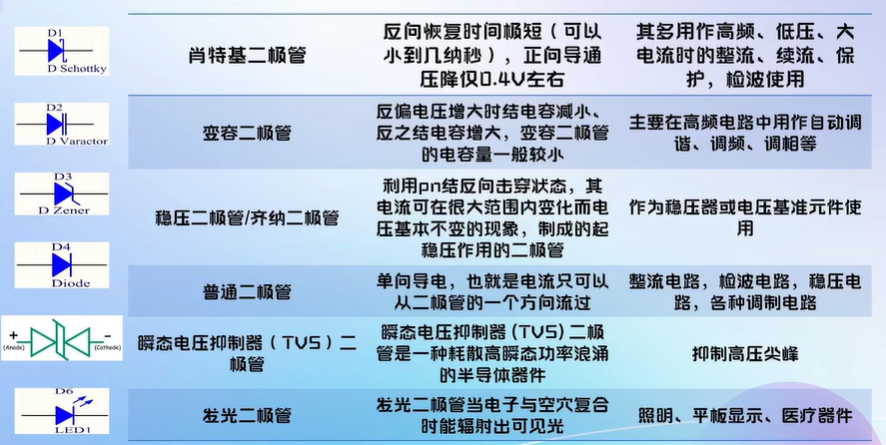
  + 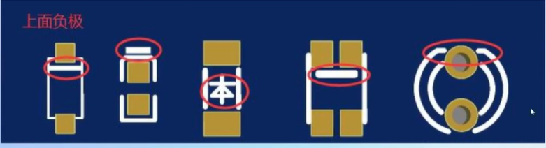

+ 三极管
  + 全称为半导体三极管，也称双极型晶体管、晶体三极管
  + 是一种**控制电流**的半导体器件
  + 作用是把微弱**信号放大**成幅度值较大的电信号，也用作**无触点开关**
  + 具用电流放大作用，是电子电路的核心元件
  + 是在一块半导体基片上制作两个相距很近的PN结，两个PN结把整块半导体分成三部分
    + 中间部分是基区
    + 两侧部分是发射区和集电区
    + 排列方式有NPN和PNP两种，简头向外NPN，简单都是发射极

+ 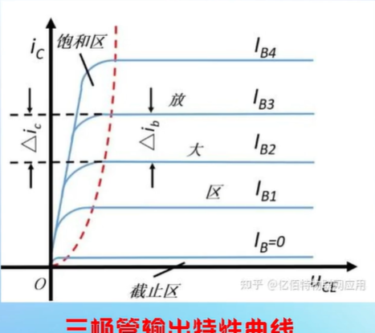
+ 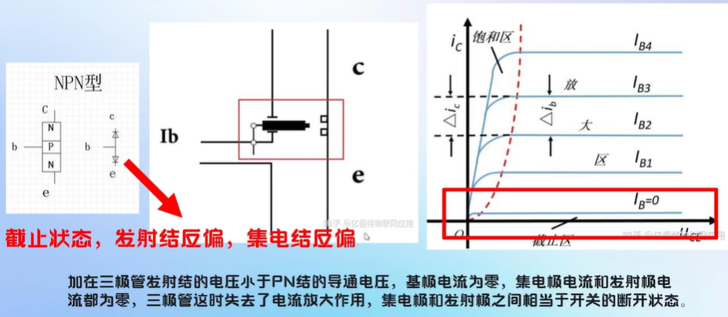
+ 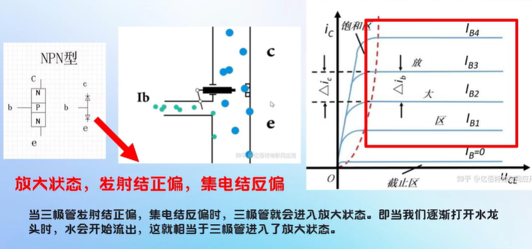
+ 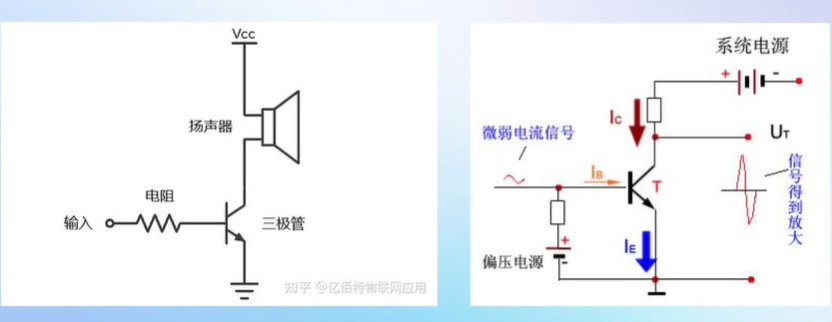
+ 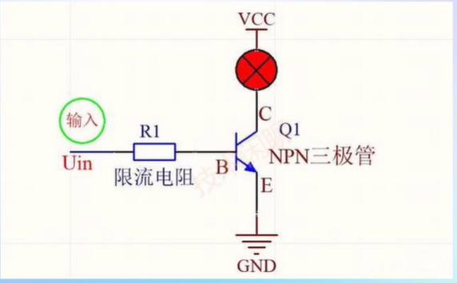

+ 场效应管 MOS管（Field Effect Transistor）
  + 是利用控制输入回路的电场效应来控制输出回路电流的一种半导体器件
  + 由于它仅靠半导体中的多数载流子导电，又称单极型晶体管
  + MOS管属于电压控制型半导体器件
  + 具有输入电阻高、噪声小、功耗低、动态范围大、易于集成、没有二次击穿现象、安全工作区域宽等优点
  + 主要有两种类型
    + 结型场效应管(junction FET-JFET)
    + 金属-氧化物半导体场效应管（metal-oxide semiconductor FET,简称MOS-FET）
  + 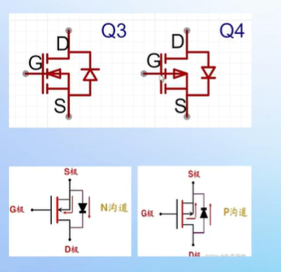
  + 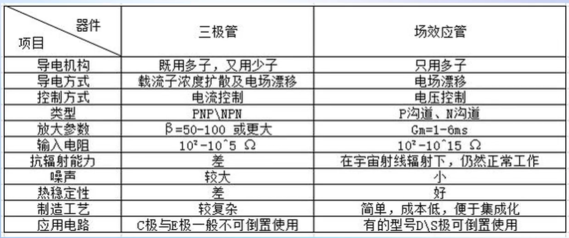
  + 当开关使用时，是根据源极和栅极间的电压

+ 数据手册（datasheet）
  + https://www.semiee.com/  半导小芯
  + 立创商城

+ 电路定理
  + 支路：
    + 电路中的每一分支叫做支路
    + 支路是由一个或几个串联的电路元件构成的，是构成复杂电路的基本电路
    + 支路是电路中通过同一电流的通路
    + 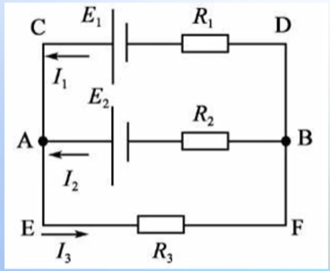
  + 回路:
    + 电路中任意一个闭合的路径叫做回路
    + 在每次所选用的回路中，至少包含一个没有选用过的新支路时，这些回路叫独立回路
    + 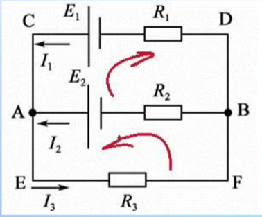
  + 网孔
    + 不可再分的回路叫做网孔
    + 对平面电路，其内部不含任何支路的回路称网孔
    + 电路中的网孔数等于独立回路数
  + 基尔霍夫定律
    + 包括基尔霍夫电流定律KCL和基尔霍夫电压定律KVL
    + 反映了电路中所有支路电压和电流所遵循的基本规律
    + 是分析**集总参数电路**的基本定律
    + **基尔霍夫定律与元件自身的特性**构成了电路分析的基础
  + 集总参数电路
    + 实际电路元件一般都和电能的消耗及电能、磁能的储存有关
    + 它们交织在一起发生在整个元件中
    + 一个实际元件可以用一到多个理想元件组合表示
    + 如下图是电阻 在 低频 和高频下的等效电路
    + 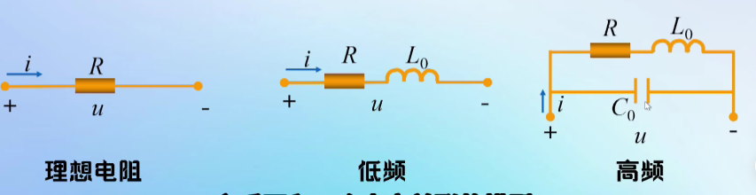
    + 理想化：假定这些现象可以分别研究，并且这些电磁过程都分别集中在各元件内部进行，这样的元件称为集总参数元件
    + 用集总参数电路模型来近似地描述实际电路是有条件的，它要求实际电路的尺寸要远小于电路工作时电磁波的波长
  + 基尔霍夫电流定律KCL
    + 在集总参数电路中，任意时刻，对任意结点流出（或流入）该结点电流的代数和等于零
    + 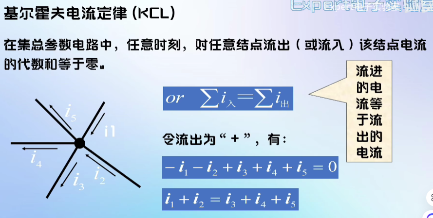
    + 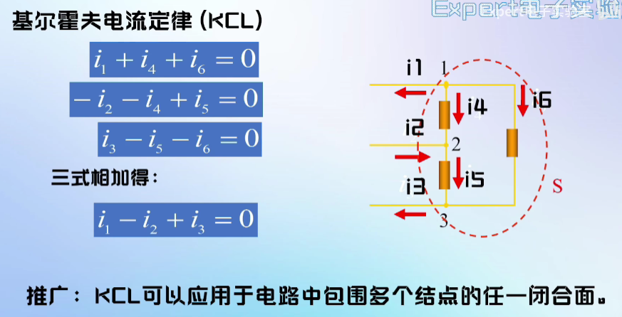
    + 实质：
      + KCL是电荷守恒和电流连续性原理在电路中任意结点处的反映
      + KCL表示结点处支路电流间的约束，与支路上的元件性质无关
      + KCL方程是按电流参考方向列写的，与电流的实际方向无关
  + 基尔霍夫电压定律KVL
    + 在集总参数电路中，任一时刻，沿任一回路，所有支路电压的代数和恒等于零
    + 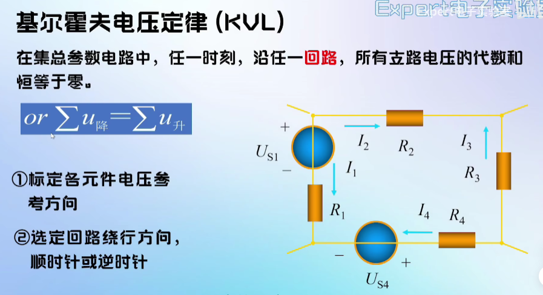
    + 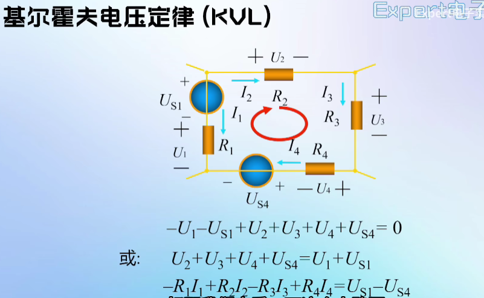
    + 实质：
      + KVL的实质反映了电路遵从能量守恒定律
        + 电位相同(同一点)=>电位差(电压)为0=>电压升降代数和为0
      + KVL表示回路中的支路电压的约束，与回路中各支路上接的元件性质无关
      + KVL方程是按电压参考方向列写，与电压实际方向无关
  + 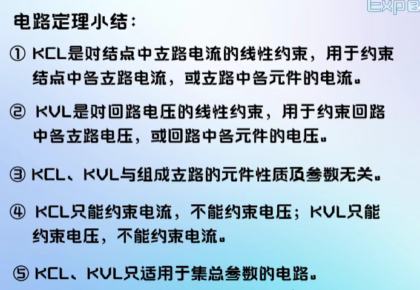
  + 参考书籍：《电路》