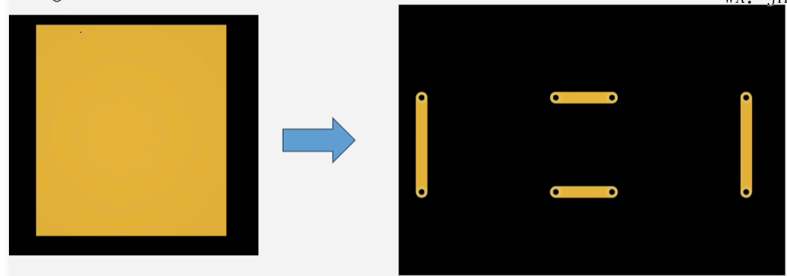
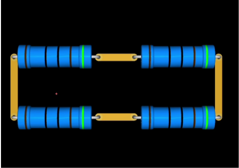
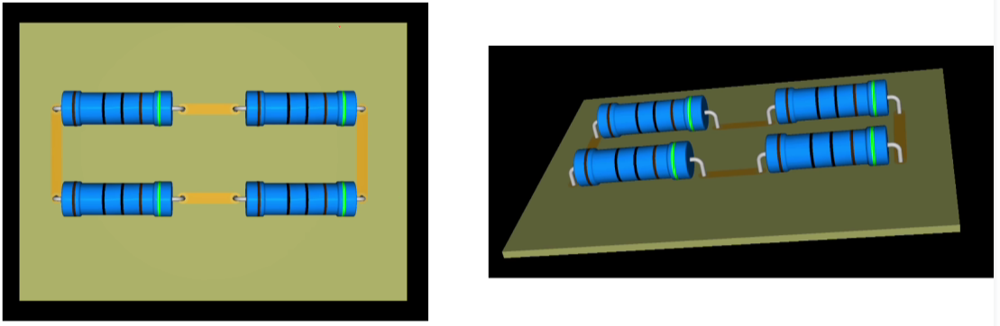
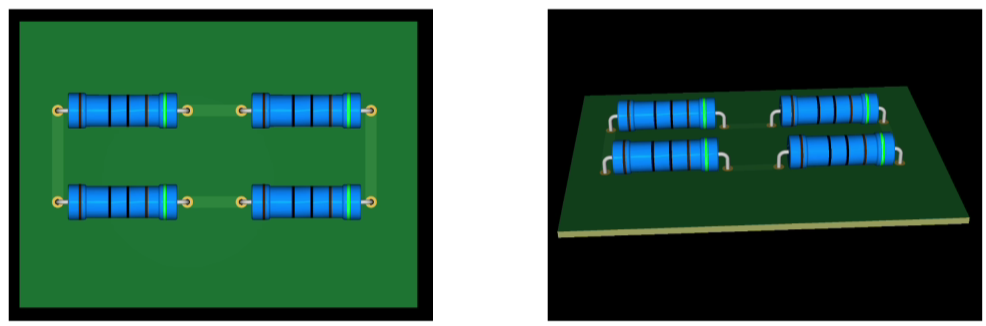
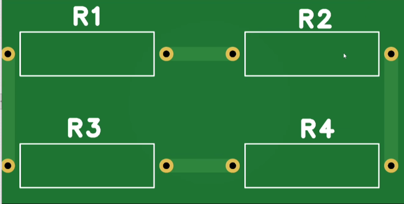
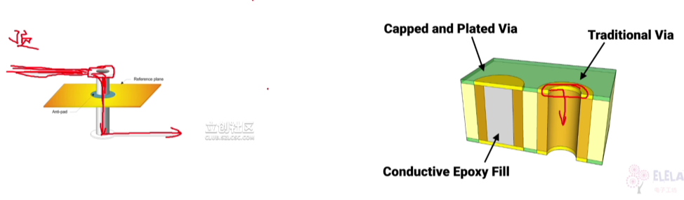
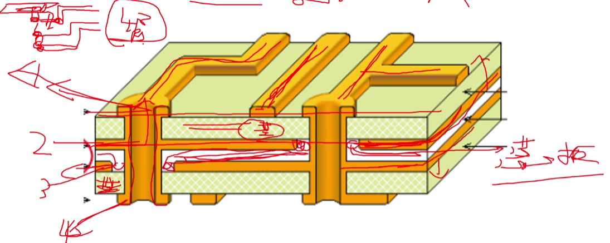
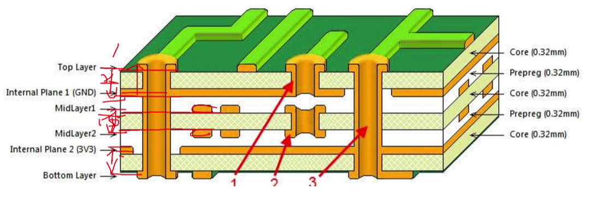
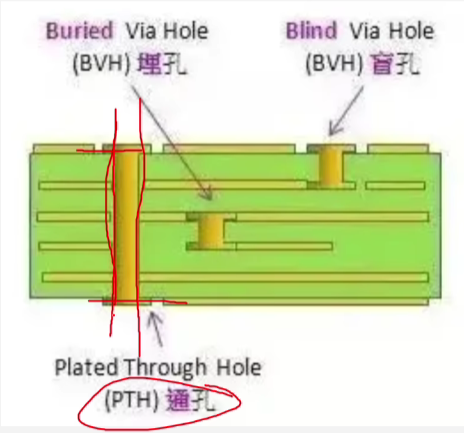

# PCB设计零基础入门

## PCB印制电路板

+ PCB（printed Circuit Board） 印刷电路板  
+ 是电子产品中的重要部件，**元器件的支撑体，更是实现诸多电子元器件电气连接的载体**  
+ 性质上更像是**连接元器件的导线**，解决线路布线麻烦的问题  
+ **把一大块铜箔，其中不需要的部分(非连接部分)腐蚀掉，最终留下连接部分的铜箔**  

## PCB的层叠结构  

### PCB单层板  加基板连接

+ 单层电路板铺铜演化过程
  1. 铜箔去铜过程，保留连接铜线部分
     +   
  2. 元器件和连接铜线示意图
     +   
  3. 将元器件和连接铜线放到基板上，基板本身不导电
     +   
  4. 增加阻焊层（常见是绿色的）
     + 为了避免连接铜线裸露在外面，防止触电  
     + 防止连接铜线氧化  
     + 让加热后的焊锡只能在焊盘上，避免流到连接铜线上，所以叫阻焊  
     + 
  5. 增加丝印层，标示各元器件位置  
     +    

### PCB双层板

+ 双层板演化过程
  1. 当两根顶层连接铜线有交叉时，必需使用双层板，把交叉的另一条连接铜线放到底层  
  2. 为了在两层线路板之间导电，需要增加**过孔**
     + 过孔是用来在两层以上线路板之间导电
     + 过孔为了导电，在孔的焊盘的和内壁都有一层铜  
     + 
  3. 当底层也有了导线后，也需要增加阻焊层，也可以增加丝印 

### PCB四层板

+ 有四层电路，每层通过不导电的基板或芯板隔开
+ 通过过孔来连接每层的电路
+ 同等面积下，层数越多，放的电路元器件越多
+ **多层板是两层两层叠加，形成多层板**，两层之间叠加时，用芯板隔开
+ **所以多层板的层数都是偶数**
+ 

### PCB六层板

+ 为什么没有三、五、七...层板
  1. 相同的过程它可以在PCB工厂制造。一般情况下，四层板芯两侧压一铜箔，三层板芯一侧压一铜箔。就工艺流程而言有必要进行冲压。
  2. 相同价格两种工艺成本的差异在于，四层板材多了一层铜箔和粘合层，成本差异不大。板材厂报价时，一般以3-4层的报价为一个等级，报价以偶数定义(当然不止多层)。例如，如果你设计了五层板，对方会按照六层板的价格报价，即你设计了三层板的价格，价格与你设计的四层板的价格相同。
  3. 过程稳定性在PCB工艺中四层板比三层板更容易控制。主要在对称性方面，四层板的曲度可控制在0.7%以下(ipc600标准)。然而，当三层板的尺寸较大时，翘曲将超过该标准，这将影响SMT贴片和整个产品的可靠性。因此，普通设计师不设计奇数层板，即使奇数层实现了功能，也将设计为伪偶数层，即5层设计为6层，7层设计为8层。
+   

### PCB的通孔、盲孔、埋孔

+ 通孔、盲孔、埋孔是**过孔的细分**  
+   
+ 定位孔用来配合安装的，内壁不铺铜

### 焊盘

+ 用来焊接元器件
+ 直插式元器件焊盘
+ 贴片式元器件焊盘